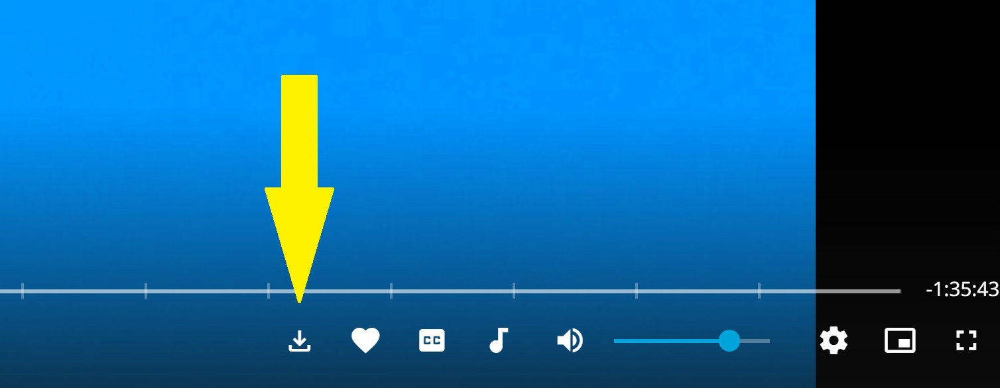

# Jellyfin VideoOSD Download Button

Credits go to HighImKevin from the Jellyfin Community, who helped me finalize this script after I was stuck on an issue for quite a while. Thanks again for the support!

---
Tested on Windows 11 on Chrome:

Adds a convenient **Download** button directly to the VideoOSD in Jellyfin Web.
With one click, you can download the currently playing video as a **1:1 original file** into your default download folder.
No menu diving. No playback interruption. Just click and download.

---

## What It Does

- Injects a **Download button** into the VideoOSD interface  
- Detects the **currently active video**
- Triggers a **direct file download** via Jellyfin’s API
- Automatically adapts when navigating between videos
- Does **not interrupt playback**

The downloaded file is identical to the source file on the server.  
No transcoding. No quality loss.

---

## How It Works

The script:

1. Detects the current video ID from the VideoOSD DOM
2. Builds a download URL using:
   - `ApiClient.serverAddress()`
   - `ApiClient.accessToken()`
3. Creates a temporary hidden `<a>` element
4. Triggers the browser’s native download mechanism
5. Uses a `MutationObserver` to:
   - Detect dynamic page changes
   - Re-inject the button if necessary
   - Track video changes

Because it uses Jellyfin’s native `/Items/{id}/Download` endpoint, the file you receive is the exact original media file stored on the server.

---

## Why It’s Useful

Normally, downloading a video in Jellyfin requires opening the item menu and selecting **Download**.

This script:

- Saves clicks
- Makes downloading faster and more accessible
- Keeps the download action directly inside the player UI
- Avoids interrupting playback

It’s especially useful if you frequently download media for offline use.

---

## Installation

### Method: Jellyfin JavaScript Injector

1. Install the **JavaScript Injector** plugin in Jellyfin (if not already installed).
2. Open Jellyfin Admin Dashboard.
3. Go to: Dashboard → Plugins → JavaScript Injector
4. Paste the entire script content into the injector.
5. Save.
6. Refresh the Jellyfin web interface.

The Download button will now appear in the VideoOSD.

---

## Compatibility

- Designed for Jellyfin Web (Windows 11, Chrome)
- Works with dynamic page navigation
- Requires a logged-in session (uses your API access token)

---

## License

MIT License
